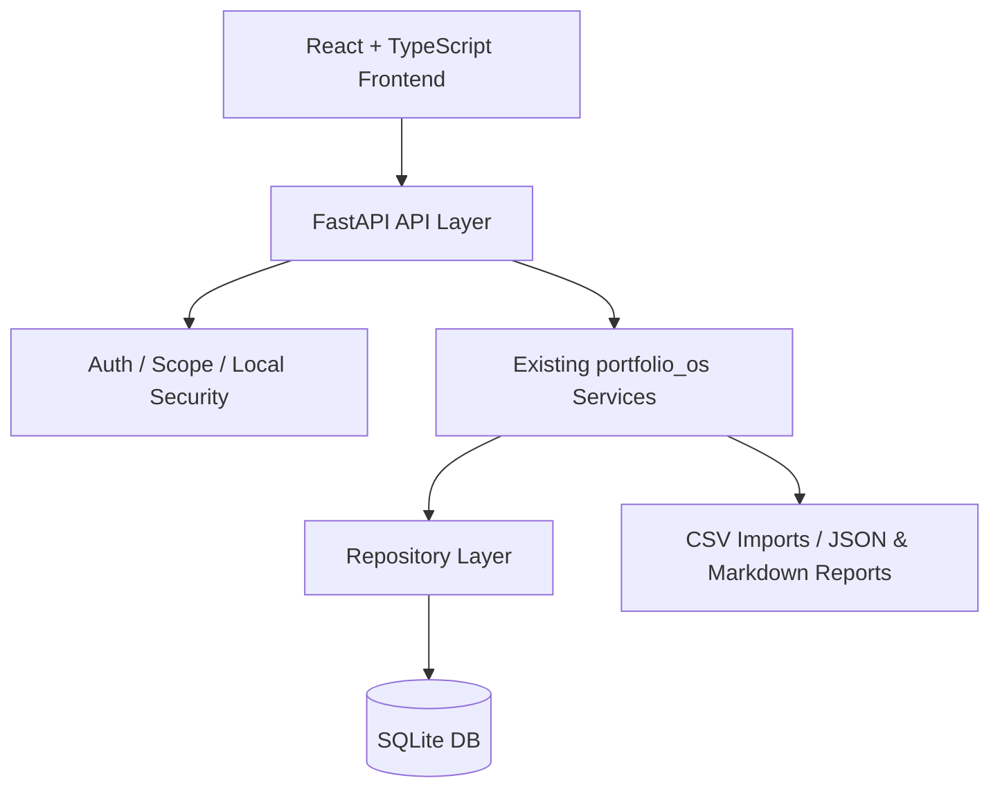

# Portfolio OS 프론트엔드 2차 개발 전략 리포트 (디자인 레퍼런스 반영판)

_Generated for `dahyeong0323/portfolio-os`_

---

## 0. Executive Summary

이 리포트의 핵심 결론은 두 가지다.

1. **Portfolio OS의 2차 개발은 “새 서비스를 다시 만드는 것”이 아니라, 이미 구현된 Python / SQLite / CLI 기반 도메인 코드를 HTTP API와 프론트엔드 화면으로 감싸는 작업**이다.
2. **프론트엔드의 시각적 방향은 일반 금융 대시보드가 아니라, 사용자가 제공한 디자인 레퍼런스 이미지의 “Mission Control” 스타일을 기준으로 고정한다.**

현재 프로젝트는 단순 Stage 1 장부 도구가 아니라, 문서와 코드 기준으로 다음 운영 흐름을 이미 상당 부분 갖고 있다.

```text
Ledger
→ Reconciliation
→ Risk Validation
→ Order Ticket
→ Human Approval
→ Manual Execution Log
→ Reconciliation Confirmation
→ Override / Journal
→ Research / Macro / Senior Memo / Governance
```

따라서 프론트엔드의 목적은 “화려한 투자 대시보드”가 아니라 **투자 운영 콘솔**이다.  
가장 먼저 제품화해야 할 것은 수익률 차트가 아니라 아래 6개다.

```text
1. Ledger Status
2. Reconciliation
3. Risk Validation
4. Order Ticket Approval
5. Manual Execution Logging
6. Override / Journal
```

권장 아키텍처는 다음이다.

```text
React + TypeScript SPA
        ↓
FastAPI Backend-for-Frontend
        ↓
기존 portfolio_os service / repository layer
        ↓
SQLite
```

장기적으로 데스크톱 앱이 필요하면 Electron보다 **Tauri 우선**이 적합하다.  
하지만 초기 2차 개발에서는 Tauri까지 바로 가지 말고, 먼저 **로컬 웹앱 + FastAPI**로 운영 루프를 닫는 것이 맞다.

---

## 1. 현재 코드베이스 성격

현재 코드베이스는 대략 다음 성격을 가진다.

```text
service / repository / dataclass 기반의 로컬 도메인 모놀리스
```

CLI는 대부분 다음 패턴을 따른다.

```text
1. Database 열기
2. Repository 또는 Service 호출
3. 결과를 JSON / Markdown / stdout으로 출력
```

즉, 프론트엔드 개발에서 가장 중요한 일은 **CLI 명령을 브라우저에서 호출하는 것**이 아니다.  
그보다 해야 할 일은 다음이다.

```text
CLI 내부에서 이미 호출하고 있는 domain service를
FastAPI endpoint로 직접 노출하는 것
```

하면 안 되는 방식:

```text
React → subprocess → portfolio-os CLI 호출
```

권장 방식:

```text
React → HTTP API → existing service/repository → SQLite
```

이렇게 해야 나중에 인증, 권한, 테스트, 배포, 데스크톱 패키징, API 문서화가 가능해진다.

---

## 2. 핵심 설계 원칙

Portfolio OS의 프론트엔드는 일반 CRUD 앱처럼 만들면 안 된다.  
이 시스템에는 권위의 순서가 있다.

```text
Ledger가 진실의 기준이다.
Reconciliation이 ledger readiness를 결정한다.
Risk Engine만 risk validation authority다.
Order Ticket만 official trade workflow다.
Senior Memo는 판단 메모이지 주문 권한이 아니다.
Research / Macro는 context이지 execution authority가 아니다.
Human approval이 최종 승인이다.
Execution은 수동 기록이다.
```

따라서 UI는 항상 다음을 구분해야 한다.

| 구분 | 의미 | UI 표시 |
|---|---|---|
| Official | Risk Engine과 Ticket workflow를 통과한 공식 상태 | 강한 badge |
| Advisory | Senior Memo / Research / Macro의 판단 보조 정보 | 보조 badge |
| Context only | 참고 자료, order authority 없음 | 회색 badge |
| Override | 인간이 시스템 제한을 인지하고 예외 선언 | 경고 badge |
| Broken / Stale | 공식 주문 제안 불가 | 차단 badge |

가장 중요한 UX 원칙:

```text
사용자가 "Buy" 버튼을 누르는 앱이 아니라,
"Intent를 만들고 → Risk 검증하고 → Ticket을 승인하고 → 수동 실행을 기록하는" 앱이어야 한다.
```

---

## 3. 디자인 방향 고정 (중요)

### 3.1 디자인 Source of Truth

이번 프론트엔드 개발에서 **시각적 디자인 방향의 기준은 사용자가 제공한 레퍼런스 이미지**다.  
즉, 앞으로 프론트엔드 구현은 “일반적인 SaaS 대시보드”를 새로 상상해서 만드는 것이 아니라, **해당 이미지의 시각 언어를 최대한 유지하면서 Portfolio OS 도메인에 맞게 구현하는 것**을 목표로 한다.

### 3.2 반드시 유지해야 하는 시각 요소

다음 요소는 구현 시 최대한 유지한다.

```text
- 전체 레이아웃 구조
- 카드 기반 정보 계층
- 좌측 사이드바 정보 구조
- 상단 시스템 상태 바
- 다크 테마 + 네온 포인트 컬러
- 중앙 대형 "Portfolio Thesis Map"
- 우측 경고 / 알림 / 빠른 액션 패널
- 하단 Activity Timeline + Open Tickets 패널
- 조종석 / 관제실 / Mission Control 같은 분위기
```

### 3.3 반드시 바꿔야 하는 것

레퍼런스 이미지의 구조는 유지하되, 내용은 Portfolio OS의 실제 도메인에 맞게 바꿔야 한다.

```text
유지할 것:
- 느낌
- 구조
- 위계
- 카드 구성 방식
- 정보 밀도
- 간격/패딩 철학

바꿀 것:
- 실제 데이터 라벨
- API 연동 데이터
- 상태 값
- 티켓 / 리스크 / 정산 / 오버라이드 등 도메인 내용
- 실제 CLI/DB 기반 기능과 연결되는 행동들
```

### 3.4 금지사항

```text
- 일반 주식앱처럼 오늘 수익률과 차트만 강조하지 말 것
- Robinhood / 업비트 / 바이낸스 같은 트레이딩 앱처럼 만들지 말 것
- Buy / Sell 버튼을 메인 CTA로 두지 말 것
- Senior Memo를 공식 추천처럼 보이게 만들지 말 것
- Research / Macro / Senior를 execution authority처럼 보이게 만들지 말 것
- “예쁜 자산현황판”에 그치지 말 것
```

---

## 4. 추천 시스템 아키텍처

### 4.1 전체 구조



### 4.2 FastAPI를 붙이는 이유

FastAPI가 적합한 이유:

- 현재 Python 도메인 코드와 자연스럽게 연결됨
- 타입 힌트 기반 request/response schema 정의 가능
- OpenAPI 자동 생성 가능
- `APIRouter`로 도메인별 router 분리 가능
- JWT / OAuth2 / CORS / Docker 문서와 패턴이 안정적
- CLI를 유지하면서 API layer를 추가하기 쉬움

권장 패키지 구조:

```text
src/portfolio_os/
  api/
    __init__.py
    app.py
    deps.py
    auth.py
    errors.py
    serialization.py
    schemas/
      ledger.py
      reconciliation.py
      risk.py
      tickets.py
      execution.py
      override.py
      journal.py
    routers/
      health.py
      ledger.py
      reconciliation.py
      risk.py
      intents.py
      tickets.py
      executions.py
      overrides.py
      journal.py
      reports.py
```

### 4.3 프론트엔드 구조

권장 구조:

```text
frontend/
  package.json
  vite.config.ts
  src/
    app/
      router.tsx
      providers.tsx
    api/
      client.ts
      generated-types.ts
      queries/
        ledger.ts
        reconciliation.ts
        risk.ts
        tickets.ts
        execution.ts
    components/
      layout/
      status/
      tables/
      forms/
      charts/
      audit/
      mission_control/
    features/
      dashboard/
      thesis_map/
      ledger/
      reconciliation/
      risk/
      tickets/
      execution/
      overrides/
      journal/
      reports/
    stores/
      ui-store.ts
    lib/
      format.ts
      guards.ts
      status-map.ts
```

---

## 5. 기술 스택 추천

| 영역 | 추천 | 이유 |
|---|---|---|
| Backend API | FastAPI | 기존 Python service/repository 재사용에 최적 |
| DB | SQLite 유지 | 현재 프로젝트 철학과 구현에 맞음 |
| Frontend | React + TypeScript | 도메인 타입이 많아서 TypeScript 필수 |
| Build tool | Vite | 로컬 앱 개발 속도 빠름 |
| Server state | TanStack Query | API cache, refetch, stale state 처리에 적합 |
| Client UI state | Zustand | wizard draft, sidebar, filter 등 작은 상태에 적합 |
| Forms | React Hook Form + Zod | 거래 intent / execution 입력 검증에 적합 |
| Basic charts | Recharts | 초기 KPI/간단 차트용 |
| Advanced visualization | Apache ECharts | Thesis map, heatmap, radar, factor exposure용 |
| Desktop wrapper | Tauri | 나중에 로컬 데스크톱화할 때 Electron보다 가벼움 |
| E2E test | Playwright | 핵심 운영 루프 테스트에 적합 |
| API contract | OpenAPI schema snapshot | frontend/backend 경계 고정 |

초기에는 너무 많은 UI 라이브러리를 넣지 않는 것이 좋다.  
P0에서는 table, form, badge, modal, timeline, diff viewer, radar chart, heatmap, node map 정도만 제대로 있으면 충분하다.

---

## 6. 화면 설계 (레퍼런스 반영)

### 6.1 전체 정보 구조

레퍼런스 이미지를 기준으로 메인 Dashboard의 정보 구조는 다음처럼 고정한다.

```text
[좌측] 네비게이션 / 메뉴
[상단] 시스템 시간 / 마지막 정산 / 시스템 상태
[상단 중앙] Authority Status Cards
[중앙 대형] Portfolio Thesis Map
[중앙 우측] System Status Overview + Factor Exposure + Risk Heatmap
[우측] Alerts & Warnings + Pending Actions
[하단 좌측] Recent Activity Timeline
[하단 중앙] Open Tickets
```

### 6.2 Sidebar 구조

사이드바는 크게 3개 섹션으로 나눈다.

```text
OPERATIONS
- 대시보드
- 전략 지도
- 레저(장부)
- 정산(Reconciliation)
- 리스크 엔진
- 주문 티켓
- 실행 기록
- 오버라이드
- 저널 / 복기

INTELLIGENCE
- 리서치 팩
- 매크로 레이어
- 시니어 메모

GOVERNANCE
- 모델 QA
- 컨텍스트 관리
- 리포트 센터
- 설정
```

### 6.3 Top System Bar

상단 바는 일반 페이지 타이틀 바가 아니라, **상태 바**여야 한다.

표시 항목 예시:

```text
- 마지막 정산 시각
- 현재 ledger status
- 시스템 시간
- 시스템 online/offline 상태
- 데이터 신선도
- 알림 아이콘
- 설정 또는 utility 아이콘
```

### 6.4 Authority Status Cards

상단의 핵심 카드들은 반드시 “권위 상태”를 보여줘야 한다.

권장 카드:

```text
- Ledger Status
- Risk Engine
- Open Tickets
- Pending Executions
- Overrides
```

각 카드는 숫자 + 상태 + 짧은 설명을 가진다.

예시:

```text
LEDGER STATUS
RECONCILED
정상
```

### 6.5 메인 Hero: Portfolio Thesis Map

이 화면의 핵심은 일반 성과 차트가 아니라 **Portfolio Thesis Map**이다.

중앙:

```text
PORTFOLIO
총 평가금액
```

주변 노드 예시:

```text
- Bitcoin Ecosystem
- AI / Semiconductor
- Space & Defense
- Leveraged ETF
- Growth Equities
- Cash & Equivalents
```

각 노드는 다음 정보를 포함한다.

```text
- 카테고리명
- 비중
- 평가금액
- 위험/상태 색상
```

구현 원칙:

```text
- 단순 pie chart로 대체하지 말 것
- 노드형 / 연결형 / command-center style map으로 구현할 것
- 사용자가 포트폴리오를 "논지 구조"로 보게 만들 것
```

### 6.6 System Status Overview

Thesis Map 오른쪽 패널에는 시스템 운영 상태를 요약한다.

권장 항목:

```text
- Reconciliation
- Risk Engine
- Data Freshness
- Model QA
- Context Budget
- Journal Sync
```

상태는 텍스트 + badge 형태로 보여준다.

예시:

```text
Reconciliation  PASSED
Risk Engine     GREEN
Data Freshness  2 days ago
```

### 6.7 Portfolio Factor Exposure

일반 수익률 차트 대신, 포트폴리오 노출 상태를 시각화한다.

권장 시각화:

```text
Radar chart / spider chart
```

축 예시:

```text
- 변동성 (NASDAQ)
- BTC 연관
- 레버리지
- 유동성 민감도
- 금리 민감도
- 글로벌 리스크온
```

### 6.8 Risk Heatmap

추가 패널로 종목별 / 요인별 Risk Heatmap을 둔다.

예시 행:

```text
BTC
QLD
TQQQ
NVDA
TSLA
현금
```

예시 열:

```text
시장 하락
금리 급등
유동성 축소
규제 리스크
FX 변동
집중 리스크
```

### 6.9 Alerts & Warnings

우측 패널은 알림센터가 아니라 **운영 경고판**이다.

예시:

```text
- Crash Playbook
- Liquidity Buffer Low
- Override Pending
- Reconciliation Due
```

강조 원칙:

```text
빨강 = 차단 / 위험
주황 = 주의
노랑 = 검토 필요
파랑 = 시스템 알림
초록 = 정상
```

### 6.10 Pending Actions

우측 하단의 빠른 액션 버튼은 일반 트레이딩 액션이 아니다.

반드시 다음 계열로 간다.

```text
- 정산 실행
- 의도 생성
- 주문 티켓 검토
- 수동 실행 기록
- 오버라이드 선언
```

다음은 금지한다.

```text
- BUY NOW
- SELL NOW
- QUICK TRADE
```

### 6.11 Recent Activity Timeline

하단 좌측은 Activity Timeline이다.

예시 이벤트:

```text
- 정산 완료
- 주문 티켓 생성
- 리스크 검증 통과
- 수동 실행 기록 대기
- 오버라이드 선언
```

각 항목에는 다음을 붙인다.

```text
- 시간
- 이벤트 제목
- 간단 설명
- event type badge (SYSTEM / TICKET / RISK / EXECUTION / OVERRIDE)
```

### 6.12 Open Tickets

하단 중앙은 열려 있는 주문 티켓 패널이다.

각 row 정보:

```text
- ticket id
- side
- instrument
- amount
- validation status
- approval 대기 여부
- 생성 시각
```

---

## 7. 기능 화면 상세

### 7.1 Dashboard

목적:

```text
오늘 Portfolio OS가 공식 판단 가능한 상태인지 한눈에 확인
```

핵심 내용:

- top system bar
- authority status cards
- portfolio thesis map
- system status overview
- portfolio factor exposure
- risk heatmap
- alerts & warnings
- pending actions
- recent activity timeline
- open tickets

### 7.2 Ledger

하위 화면:

```text
Accounts
Instruments
Transactions
Cash Balances
Liabilities
Tax Reserves
```

중요 UX:

- 거래 기록은 append-only 성격을 강조
- 수정은 직접 edit보다 correction / reversal / void flow로 유도
- Decimal 값을 문자열 기반으로 입력받고 표시
- “데이터 입력 화면”이 아니라 “공식 장부 화면”이라는 느낌 유지

### 7.3 Reconciliation

핵심 흐름:

```text
External snapshot import
→ expected vs actual diff
→ passed / failed / needs_review
→ ledger status update
→ report export
```

필수 UI:

- CSV/JSON import wizard
- diff table
- missing / ambiguous instrument warning
- cash diff / position diff / liability diff / tax reserve diff
- latest reconciliation report viewer

### 7.4 Risk Workspace

핵심 흐름:

```text
Intent 생성
→ Risk Validation 실행
→ passed / adjusted / rejected 확인
→ ticket 생성 가능 여부 표시
```

표시해야 할 것:

- Requested notional / quantity
- Approved adjusted notional / quantity
- Failed checks
- Warnings
- Ledger gate result
- Price / FX availability
- Cash before / after
- Tax reserve protection

### 7.5 Order Tickets

핵심 흐름:

```text
validated ticket
→ approve / reject / modify
→ manual execution 가능
→ pending reconciliation
→ reconciled / broken
```

필수 UI:

- ticket list
- ticket detail
- event timeline
- approval modal
- rejection reason modal
- modify flow
- linked risk validation
- linked decision journal

### 7.6 Manual Execution

핵심 흐름:

```text
승인된 ticket 선택
→ 실제 MTS/HTS 체결 정보 입력
→ provisional transaction 생성
→ pending reconciliation 표시
```

입력 필드:

- filled quantity
- fill price
- fee
- tax
- executed_at
- broker reference
- notes

### 7.7 Override & Journal

핵심 흐름:

```text
official flow가 막힘
→ override 선언
→ risk warning 확인
→ human confirmation
→ manual execution 기록
→ postmortem due date 생성
```

중요 UX:

- Override는 “추천”이 아니라 “예외 선언”임을 강하게 표시
- 이유 입력 필수
- 나중에 postmortem reminder 가능하도록 구조화

---

## 8. API 설계 초안

### 8.1 Health / System

| Method | Path | Description |
|---|---|---|
| GET | `/api/v1/health` | API, DB, migration 상태 |
| GET | `/api/v1/system/config` | 현재 DB path, mode, feature flags |
| GET | `/api/v1/system/features` | Stage별 활성화 여부 |

### 8.2 Ledger

| Method | Path | Description |
|---|---|---|
| GET | `/api/v1/ledger/status` | 현재 ledger status |
| GET | `/api/v1/ledger/snapshot` | 특정 날짜 기준 snapshot |
| GET | `/api/v1/accounts` | 계좌 목록 |
| POST | `/api/v1/accounts` | 계좌 생성 |
| GET | `/api/v1/instruments` | 종목 목록 |
| POST | `/api/v1/instruments` | 종목 생성 |
| GET | `/api/v1/transactions` | 거래 내역 |
| POST | `/api/v1/transactions` | 거래 기록 |
| GET | `/api/v1/cash-balances` | 현금 anchor |
| POST | `/api/v1/cash-balances` | 현금 anchor 기록 |
| GET | `/api/v1/liabilities` | 부채 |
| POST | `/api/v1/liabilities` | 부채 기록 |
| GET | `/api/v1/tax-reserves` | 세금 준비금 |
| POST | `/api/v1/tax-reserves` | 세금 준비금 기록 |

### 8.3 Reconciliation

| Method | Path | Description |
|---|---|---|
| POST | `/api/v1/snapshots/external-imports` | 외부 snapshot import |
| POST | `/api/v1/reconciliations` | reconciliation 실행 |
| GET | `/api/v1/reconciliations/latest` | 최신 reconciliation |
| GET | `/api/v1/reconciliations/{id}` | 상세 결과 |
| GET | `/api/v1/reconciliations/{id}/report` | Markdown/JSON report |

### 8.4 Risk / Intent

| Method | Path | Description |
|---|---|---|
| GET | `/api/v1/prices` | 가격 snapshot 목록 |
| POST | `/api/v1/prices` | 가격 입력 |
| GET | `/api/v1/fx-rates` | FX 목록 |
| POST | `/api/v1/fx-rates` | FX 입력 |
| GET | `/api/v1/risk/policies` | risk policy 목록 |
| POST | `/api/v1/risk/policies` | risk policy 생성 |
| GET | `/api/v1/risk/rules` | risk rule 목록 |
| POST | `/api/v1/risk/rules` | risk rule 추가 |
| POST | `/api/v1/intents` | transaction intent 생성 |
| GET | `/api/v1/intents/{id}` | intent 상세 |
| POST | `/api/v1/intents/{id}/validate` | risk validation 실행 |
| GET | `/api/v1/risk/validations/{id}` | validation 상세 |

### 8.5 Tickets / Execution

| Method | Path | Description |
|---|---|---|
| GET | `/api/v1/tickets` | ticket 목록 |
| POST | `/api/v1/tickets` | validation에서 ticket 생성 |
| GET | `/api/v1/tickets/{id}` | ticket 상세 |
| POST | `/api/v1/tickets/{id}/approve` | 승인 |
| POST | `/api/v1/tickets/{id}/reject` | 거절 |
| POST | `/api/v1/tickets/{id}/modify` | 수정 |
| GET | `/api/v1/executions/pending` | reconciliation 대기 execution |
| POST | `/api/v1/executions` | manual execution 기록 |
| POST | `/api/v1/executions/confirm-after-reconciliation` | reconciliation 후 확정 |

### 8.6 Overrides / Journal

| Method | Path | Description |
|---|---|---|
| GET | `/api/v1/overrides` | override 목록 |
| POST | `/api/v1/overrides` | override 선언 |
| POST | `/api/v1/overrides/{id}/confirm` | override 확인 |
| POST | `/api/v1/overrides/{id}/execution` | override execution 기록 |
| GET | `/api/v1/journal` | decision journal |
| POST | `/api/v1/postmortems` | postmortem task 생성 |

---

## 9. 상태 모델과 UI Badge

### 9.1 Ledger status

| Status | 의미 | 공식 행동 |
|---|---|---|
| `reconciled` | 실제 계좌와 대조 완료 | risk-increasing official flow 가능 |
| `provisional` | 미확정 입력 있음 | risk-reducing 또는 warning flow |
| `stale` | 오래 대조 안 됨 | 신규 risk-increasing 제한 |
| `broken` | 불일치 또는 matching 문제 | official ticket 차단, correction/override만 |

### 9.2 Ticket status

```text
validated
approved
rejected
modified
expired
executed_provisional
reconciled
broken
cancelled
```

UI는 각 ticket의 다음 action을 서버 응답 기준으로만 보여줘야 한다.  
프론트에서 상태 전이를 독자적으로 판단하면 안 된다.

권장 response pattern:

```json
{
  "ticket": {},
  "available_actions": ["approve", "reject", "modify"],
  "blocked_actions": [
    {
      "action": "execute",
      "reason": "Ticket is not approved yet"
    }
  ]
}
```

---

## 10. 보안 / 운영 모델

### 10.1 기본 운영 모드

초기 추천:

```text
Local-only single user
FastAPI runs on localhost
SQLite stored locally
Frontend served locally
No broker write API
No cloud sync
```

### 10.2 repo와 데이터 분리

절대 GitHub에 올리면 안 되는 것:

```text
data/portfolio_os.sqlite3
data/imports/
data/exports/
.env
실제 계좌 CSV
실제 broker snapshot
실제 체결 내역
API keys
```

### 10.3 인증

초기에는 단일 사용자라 하더라도 최소한 다음을 준비한다.

```text
local password
JWT access token
scopes
read-only mode
sandbox mode
```

권장 scope:

```text
ledger:read
ledger:write
reconciliation:read
reconciliation:write
risk:read
risk:write
ticket:read
ticket:write
ticket:approve
execution:write
override:write
override:confirm
audit:read
admin
```

### 10.4 read-only sandbox

프론트엔드 초기 개발은 실제 DB가 아니라 sandbox DB로 한다.

```text
data/dev/portfolio_os_sample.sqlite3
```

운영 DB 접근은 나중에 켠다.

---

## 11. 테스트 전략

### 11.1 Backend

필수 테스트:

```text
pytest
API contract tests
OpenAPI schema snapshot test
migration smoke test
permission/scope test
idempotency test
state transition test
```

특히 반드시 테스트해야 할 flow:

```text
1. ledger snapshot load
2. reconciliation passed / failed / needs_review
3. intent → validation passed
4. intent → validation rejected
5. validation → ticket
6. ticket approve → execution log
7. execution → provisional transaction
8. reconciliation → execution confirmed
9. broken ledger → official ticket blocked
10. broken ledger → override allowed
```

### 11.2 Frontend

필수 테스트:

```text
TypeScript typecheck
unit test for formatting / guards
component smoke tests
MSW API mock tests
Playwright E2E tests
```

최소 E2E:

```text
Dashboard loads ledger status
Run reconciliation and see diff result
Create intent → validate → create ticket → approve
Approved ticket → log execution
Declare override → confirm → log override execution
```

UI 회귀 테스트 추가 권장:

```text
- Dashboard visual regression
- Sidebar layout regression
- Thesis Map rendering regression
- Alerts panel regression
- Ticket detail page regression
```

---

## 12. 개발 로드맵

### Phase 0 — API contract freeze

목표:

```text
Frontend가 의존할 최소 API 계약을 먼저 고정
```

산출물:

```text
docs/frontend_api_contract.md
src/portfolio_os/api/schemas/*
OpenAPI schema snapshot
```

### Phase 1 — FastAPI read-only backend

목표:

```text
브라우저에서 현재 Portfolio OS 상태를 읽을 수 있게 만들기
```

구현:

```text
GET /health
GET /ledger/status
GET /ledger/snapshot
GET /accounts
GET /instruments
GET /reconciliations/latest
GET /tickets
GET /executions/pending
```

### Phase 2 — Mission Control Shell + Dashboard UI

목표:

```text
터미널 없이 현재 상태를 확인하고,
레퍼런스 이미지 기반의 조종석 UI 뼈대를 구현
```

구현:

```text
App shell
Sidebar sections
Top system bar
Authority status cards
Portfolio Thesis Map placeholder / first version
System status overview
Alerts & warnings panel
Pending actions panel
Recent activity timeline
Open tickets panel
```

### Phase 3 — Reconciliation UI

목표:

```text
터미널 없이 snapshot import와 대조 실행
```

구현:

```text
snapshot upload
run reconciliation
diff viewer
latest report viewer
```

### Phase 4 — Stage 2 operating loop API

목표:

```text
거래 intent, risk validation, ticket, execution API 제공
```

구현:

```text
POST /intents
POST /intents/{id}/validate
POST /tickets
POST /tickets/{id}/approve
POST /tickets/{id}/reject
POST /executions
POST /overrides
```

### Phase 5 — Stage 2 operating loop UI

목표:

```text
터미널 없이 실제 거래 운영 루프 닫기
```

구현:

```text
Intent wizard
Risk validation result page
Ticket detail page
Approval modal
Execution logging form
Override declaration flow
Journal timeline
```

### Phase 6 — Dashboard 고도화

목표:

```text
레퍼런스 이미지 수준에 더 가깝게 시각화 품질 향상
```

구현:

```text
Interactive thesis map
Radar factor exposure
Risk heatmap
Alert grouping
Dashboard density tuning
Dark mission-control theme refinement
```

### Phase 7 — Reports Center

목표:

```text
기존 Markdown/JSON report를 UI에서 열람
```

구현:

```text
reconciliation reports
risk reports
order ticket reports
senior memo reports
governance reports
```

### Phase 8 — Stage 3~5 read-only explorer

목표:

```text
Research / Macro / Senior / Governance를 context viewer로 붙이기
```

주의:

```text
초기에는 read-only 또는 restricted edit
절대 order authority처럼 보이면 안 됨
```

### Phase 9 — Desktop packaging

목표:

```text
로컬 데스크톱 앱처럼 실행
```

추천:

```text
Tauri wrapper
local config
DB path picker
backup/export helper
```

---

## 13. Codex / Cursor에게 줄 구현 프롬프트

### 13.1 백엔드 + API 기초 프롬프트

```text
You are working on the GitHub repository dahyeong0323/portfolio-os.

Goal:
Implement the first frontend/backend foundation for Portfolio OS without rewriting the existing domain logic.

Important principles:
- Reuse existing portfolio_os service/repository/dataclass layers.
- Do not call the CLI through subprocess from the frontend.
- Add a thin FastAPI API layer.
- Keep SQLite server-side only.
- Do not implement broker write/execution.
- Do not implement automatic trading.
- Do not commit real data under data/.
- Preserve existing tests.
- Add tests for the new API layer.

First task:
1. Inspect pyproject.toml, src/portfolio_os/cli/main.py, src/portfolio_os/cli/stage2_commands.py, src/portfolio_os/db, repositories, ledger, reconciliation, risk, tickets, execution, override, journal.
2. Propose an API package structure under src/portfolio_os/api.
3. Implement only read-only endpoints first:
   - GET /api/v1/health
   - GET /api/v1/ledger/status
   - GET /api/v1/ledger/snapshot
   - GET /api/v1/accounts
   - GET /api/v1/instruments
   - GET /api/v1/reconciliations/latest
   - GET /api/v1/tickets
   - GET /api/v1/executions/pending
4. Add Pydantic response schemas.
5. Use existing Database, repositories, LedgerSnapshotBuilder, LedgerStateMachine, and serialization helpers.
6. Add pytest API tests using the existing test DB fixtures.
7. Do not touch Stage 1/2 domain logic except where absolutely necessary.
8. After implementation, show:
   - files changed
   - API routes added
   - tests added
   - commands to run
```

### 13.2 프론트엔드 구현 프롬프트 (레퍼런스 이미지 강제 버전)

```text
Continue from the existing FastAPI foundation.

Goal:
Add the first React + TypeScript frontend shell for Portfolio OS.

IMPORTANT UI REFERENCE:
There is a provided reference dashboard image.
Do NOT build a generic finance dashboard.
Analyze the reference image and reproduce its visual language as closely as possible while adapting the content to Portfolio OS.

Preserve:
- overall layout structure
- spacing philosophy
- card hierarchy
- typography scale
- visual density
- sidebar style
- dashboard composition
- dark mission-control atmosphere

Constraints:
- Use React + TypeScript.
- Use TanStack Query for server state.
- Do not use Redux.
- Keep SQLite server-side only.
- No broker execution.
- No trading buttons that bypass risk validation.
- Every action must correspond to an API route and backend authority.
- Korean labels in the first UI version.

Required visual direction:
- Dark theme
- Neon cyan / green / amber / red status colors
- Desktop-first
- Mission Control / hedge-fund terminal feeling
- Not a stock trading app
- Not a crypto exchange
- Not a personal finance tracker

Required layout:
1. Left sidebar with sections:
   - OPERATIONS
   - INTELLIGENCE
   - GOVERNANCE
2. Top system bar:
   - last reconciliation time
   - current system time
   - system status
3. Top authority cards:
   - Ledger Status
   - Risk Engine
   - Open Tickets
   - Pending Executions
   - Overrides
4. Main center panel:
   - Portfolio Thesis Map
5. Right/center supporting panels:
   - System Status Overview
   - Portfolio Factor Exposure
   - Risk Heatmap
6. Right side panel:
   - Alerts & Warnings
   - Pending Actions
7. Bottom panels:
   - Recent Activity Timeline
   - Open Tickets

Primary CTAs must be:
- 정산 실행
- 의도 생성
- 주문 티켓 검토
- 수동 실행 기록
- 오버라이드 선언

Do NOT use these as primary CTAs:
- Buy Now
- Sell Now
- Quick Trade

Implement:
1. Vite React frontend under frontend/.
2. API client generated or manually typed from OpenAPI.
3. App shell with the reference-image-inspired layout.
4. Dashboard page matching the reference composition as closely as practical.
5. Ledger page.
6. Reconciliation page.
7. Use mocked API fallback for local development if backend is not running.
8. Add basic tests and build scripts.

Before coding:
- explain which visual patterns from the reference image you will reuse
- provide a component structure / wireframe plan
- then implement
```

---

## 14. 가장 큰 리스크

### 14.1 CLI를 억지로 UI에 붙이는 것

가장 나쁜 선택:

```text
Frontend → run CLI command → parse stdout
```

이건 초반에는 쉬워 보이지만 나중에 반드시 무너진다.

문제:

- 에러 처리가 어려움
- 상태 전이 검증이 분산됨
- 인증/권한 불가능
- stdout format이 API contract가 됨
- 테스트가 어려움

### 14.2 디자인 레퍼런스 없이 일반 대시보드로 새로 만드는 것

가장 흔한 실패는 다음이다.

```text
“투자앱 같으면 되겠지”
→ 일반 SaaS admin dashboard 생성
→ Portfolio OS의 정체성 상실
```

따라서 이번 프론트엔드 작업은 **디자인 레퍼런스 이미지를 source of truth처럼 취급**해야 한다.

### 14.3 Stage 3~5를 너무 빨리 UI화하는 것

Research, Macro, Senior, Governance는 멋있다.  
하지만 실제 사용 가치는 Stage 1+2 루프가 닫힌 뒤 생긴다.

초기 우선순위:

```text
Ledger → Reconciliation → Risk/Ticket/Execution → Override/Journal
```

그 다음:

```text
Research/Macro → Senior → Governance/Context
```

### 14.4 UI가 권위 경계를 흐리는 것

Senior Memo를 멋있게 보여주다 보면 사용자는 그것을 “추천”으로 받아들일 수 있다.  
따라서 UI는 반드시 다음 문구를 반복해야 한다.

```text
This memo is not an order ticket.
This candidate is not risk validated.
Official action requires Risk Engine validation and human approval.
```

한국어 UI라면:

```text
이 메모는 주문 티켓이 아닙니다.
이 후보 행동은 아직 Risk Engine 검증을 통과하지 않았습니다.
공식 행동은 Risk 검증과 인간 승인이 필요합니다.
```

---

## 15. 최종 권고

가장 현실적인 2차 개발 순서는 다음이다.

```text
1. FastAPI read-only API
2. Mission Control shell + Dashboard UI
3. Reconciliation UI
4. Stage 2 operating loop API
5. Intent / Risk / Ticket / Execution UI
6. Override / Journal UI
7. Dashboard refinement
8. Reports Center
9. Research / Macro / Senior read-only explorer
10. Tauri desktop wrapper
```

이 프로젝트의 프론트엔드는 투자 앱처럼 보이면 안 된다.  
**운영체제의 조종석**처럼 보여야 한다.

최종 문장:

```text
Portfolio OS frontend is not a stock dashboard.
It is a mission-control cockpit for ledger truth, risk gates, human approval, manual execution, and audit memory.
```

---

## 16. 참고한 주요 자료

- Portfolio OS GitHub Repository: `https://github.com/dahyeong0323/portfolio-os`
- Portfolio OS Bible
- Portfolio OS Macro Stage Roadmap
- Portfolio OS v1 Development Report
- 기존 프론트엔드 2차 개발 전략 리포트
- 사용자 제공 디자인 레퍼런스 이미지
- FastAPI official documentation
- React official documentation
- TanStack Query documentation
- Zustand documentation
- Tauri documentation
- Electron security documentation
